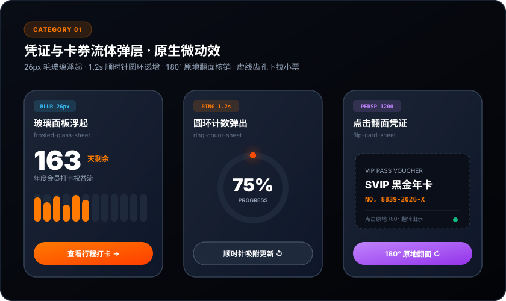
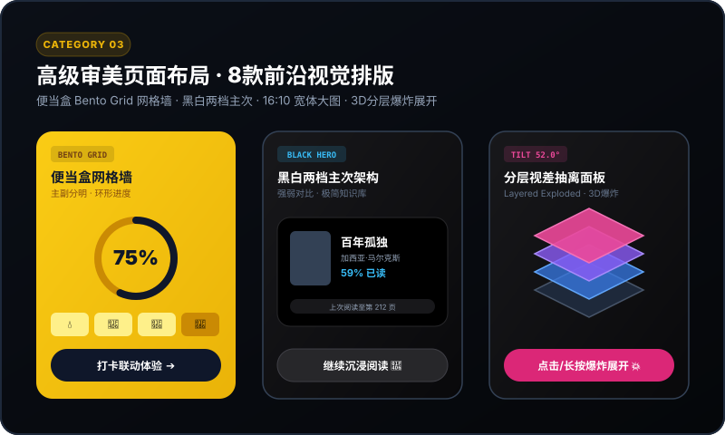

# wechat-miniprogram-ui (微信小程序高端 UI & 动效组件库)

[](https://github.com/Corps-Cy/wechat-miniprogram-ui)
[](./LICENSE)
[](https://mp.weixin.qq.com/)
[]()
[](https://corps-cy.github.io/wechat-miniprogram-ui/)

专门用于微信小程序 UI 设计、精美动效凭证组件库与页面开发的 **AI Agent Skill & 生产级开源组件库**（适配 Antigravity / Claude Code / Cursor / 微信开发者工具）。

已完整收录并重构 **28 款现代工业级设计水准组件**，涵盖 4 大核心维度：**凭证流体弹层**、**质感微动效**、**高级审美页面布局**与**触觉高级手势交互**。

> 💡 **无需本地安装微信模拟器！** 访问 [**🌐 在线 Web 模拟器 (Live Interactive Playground)**](https://corps-cy.github.io/wechat-miniprogram-ui/) 即可在浏览器中直接体验 3D 景深倾斜、动效弹窗、便当盒网格与撤销倒计时等组件的高保真实时交互！

---

## 📱 核心 Demo 交互体验与效果矩阵 (Live Demo Preview)

本项目在 `miniprogram/pages/demo` 中内置了完整的**原生全量交互体验看板**，并在 `docs/` 提供了 **免安装模拟器的网页端在线交互 Playground**。

| 模块分类 | 内置组件数 | 核心真实 Demo 效果与交互响应 | 体验路径 |
| :--- | :---: | :--- | :--- |
| **01. 凭证与卡券流体弹层** | 6 款 | • **毛玻璃浮起**：26px 高斯模糊遮罩 + 12月格子错帧梯次自底向上平滑填充<br>• **圆环计数**：背景平滑压暗 + 1.2s 顺时针环形进度绘制与数字线性递增<br>• **刻度尺扫动**：53 根周刻度逐帧扫描至“今天”+ 原地等宽无抖动防伪编号展开<br>• **照片抽屉咬合**：海报 1.08→1.0 铺满 + `-44rpx` 负边距抽屉紧密推入贴合<br>• **180° 原地翻面**：1200px 3D 空间景深，绕 Y 轴原地翻转出示核销二维码<br>• **下拉展开小票**：虚线齿孔与阻尼手柄，下拉超 40% 自动吸附展开就餐单据 | 演示页 ➔ `01 凭证弹窗` |
| **02. 质感微动效与核心组件** | 8 款 | • **3D 跟手倾斜面板**：触摸跟随 ±5° 视差浮动 + 径向高光反射 + 松手物理 Spring 回正<br>• **流体胶囊形变**：顶栏小胶囊点击如水滴般流畅延展为完整操作面板<br>• **共享元素无缝过渡**：列表卡片点击原地膨胀全屏，无白屏与跳变感<br>• **磁吸游标与滚动码表**：折线图拖拽自动磁吸节点 + 机械数字翻滚 + 轻量微震<br>• **阻尼弹性抽屉**：橡皮筋拉伸物理阻尼 + LOW / MID / FULL 档位吸附<br>• **动态弥散光晕边框**：GPU 加速 360° 流光锥形描边 + 呼吸式背光晕染<br>• **瀑布流弹簧交错流**：0.1s 错开交错弹性滑入 + 支持重播与点击弹性反馈<br>• **触觉微缩按钮**：按压 Scale 0.96 深度凹陷 + 松手 +1.1% 超调弹跳与微震 | 演示页 ➔ `02 质感微动效` |
| **03. 高级审美页面布局** | 8 款 | • **宽体标题整宽大图列表**：大写宽标题 + 16:10 宽幅卡片 + 圆形操作联动<br>• **大图头块叠加与温度曲线**：1/3 屏幕大图压暗 + 曲线光晕跟踪与日期切换<br>• **黑白两档主次架构**：浅灰底色 + 纯黑卡片视觉焦点 + 快速展开章节<br>• **便当盒网格墙 (Bento Grid)**：品牌黄主视觉卡片 + 环形进度 + 四列微打卡方块<br>• **海报大字半圆转盘**：超粗海报标题 + 半圆弧形指针吸附 + 专注流切换<br>• **层叠卡片牌组 (Stacked Deck)**：3D 景深层叠，向上滑牌飞离与循环补位<br>• **分层视差抽离面板**：3D 轴测透视 + 四层硬件视差爆炸展开与阴影扩散<br>• **重叠咬合阶梯排版**：负外边距卡片咬合压住底图标签 + 错位视觉节奏 | 演示页 ➔ `03 审美页面布局` |
| **04. 触觉高级手势与提示** | 6 款 | • **WXS 左右滑牌堆叠**：WXS 视图层 60fps 物理旋转阻尼，左滑忽略/右滑喜欢<br>• **裂变流体胶囊按钮**：悬浮胶囊一分为二平滑分裂为控制按钮，触觉震动<br>• **双向联动分类 (Scroll Spy)**：左侧锚点侧栏与右侧内容流 60fps 双向丝滑定位<br>• **4秒倒计时撤销条**：线性进度条倒计时，提供手滑后悔机制，自然平滑隐退<br>• **红点弧线回弹消散**：点击红点沿原位弧线微缩消散，错开4帧联动上级角标递减<br>• **状态形变图标**：汉堡与叉号平滑变形、播放与暂停、发送转对勾动画 | 演示页 ➔ `04 触觉高级交互` |

---

## 🎨 视觉成品与动效设计一览 (Design Previews)

<div align="center">

### 01 · 凭证与卡券流体弹层 (Fluid Voucher Sheets)


### 02 · 质感微动效与核心组件 (Tactile Motions)


### 03 · 高级审美页面布局 (Aesthetic Layouts)


### 04 · 触觉高级手势交互 (Advanced Gestures & Interactions)


</div>

---

## ✨ 核心亮点 (Core Advantages)

- ⚡️ **60fps 极限流畅跟手**：所有拖拽、滑动切卡、抽屉升降均由 **WXS (WeiXin Script)** 在视图渲染层独立计算，杜绝跨线程频繁 `setData` 引起的卡顿与掉帧。
- 🌊 **统一物理动效规范**：
  - 核心减速曲线：`cubic-bezier(0.2, 0.7, 0.2, 1)`（平滑柔和的物理减速）
  - 弹性回弹曲线：`cubic-bezier(0.175, 0.885, 0.32, 1.25)`（具备有机回弹特质）
  - 错帧进场机制（Stagger）：子元素错开 16ms ~ 66ms 梯次入场。
- 📳 **多级触觉物理反馈 (Tactile Haptics)**：在卡位吸附、圆环闭合、撤销倒计时、胶囊裂变时智能触发微信轻量震动 (`wx.vibrateShort({ type: 'light' })`)。
- 📐 **100vw 全面屏自适应**：严谨的盒模型设计，彻底消除屏幕横向滚动溢出与白边隐患，完美贴合底部安全区 `env(safe-area-inset-bottom)`。
- 🧩 **零构建负担**：纯原生 JavaScript、WXML、WXSS 与 WXS，**无需 TypeScript 编译配置**，开箱即用无语法报错。

---

## 🗂️ 28 款核心组件矩阵与分类清单 (Component Catalog)

### 📂 分类 01：凭证与卡券流体弹层 (01~06 Popup Panels)
专为会员年卡、消费券、到场核销凭据、预订小票等场景打造的高沉浸度弹窗体系：

| 组件标识 | 中文名称 | 核心动效与参数标准 | 最佳应用场景 |
| :--- | :--- | :--- | :--- |
| [`frosted-glass-sheet`](miniprogram/components/frosted-glass-sheet/) | **玻璃面板浮起** | `26px 高斯模糊` + 0.94 放大微浮 + 12 个月份格子错开 4 帧（~66ms）自底向上平滑填充 | 年度会员打卡、权益消耗统计 |
| [`ring-count-sheet`](miniprogram/components/ring-count-sheet/) | **圆环计数弹出** | 背景压暗 40% + 底部面板升起后，1.2s 顺时针绘制圆环 + 数字平滑滚动至 326 | 剩余天数倒计时、到期提醒 |
| [`tick-ruler-sheet`](miniprogram/components/tick-ruler-sheet/) | **刻度尺扫到今天** | 纸质票据质感滑入 + 53 周刻度逐根变深 + 原地等宽无抖动展开完整防伪编号 | 手账式凭证、周计划达成度 |
| [`photo-drawer-sheet`](miniprogram/components/photo-drawer-sheet/) | **照片抽屉贴合** | 沉浸式海报 1.08 -> 1 缩放铺满 + `-44rpx` 负边距抽屉咬合推入 + 水平进度条延时展开 | 美食/度假酒店通兑、海报票据 |
| [`flip-card-sheet`](miniprogram/components/flip-card-sheet/) | **点击翻面凭证** | `1200px 景深` + 沿 Y 轴 180° 原地翻转，正面常规展示，背面翻出动态核销二维码 | 演出入场门票、特权卡核销 |
| [`drag-expand-sheet`](miniprogram/components/drag-expand-sheet/) | **下拉展开面板** | 虚线齿孔折痕设计 + 2° 物理微晃 + 向下拉动超过 40% 顺滑展开完整就餐明细小票 | 预订排队凭据、点餐明细单 |

---

### 📂 分类 02：质感微交互与核心组件 (07~14 Tactile Motions)
提升 App 与小程序界面“物理实体质感”与“细腻手感”的交互组件：

| 组件标识 | 中文名称 | 核心动效与参数标准 | 最佳应用场景 |
| :--- | :--- | :--- | :--- |
| [`tilt-glare-card`](miniprogram/components/tilt-glare-card/) | **3D倾斜光影面板** | 跟随触摸坐标 ±5° 3D 浮动倾斜 + 径向流光高光反射 + 松手物理 Spring 回正 | 高端装备展示、贵宾卡券展示 |
| [`fluid-morph-sheet`](miniprogram/components/fluid-morph-sheet/) | **流体胶囊形变** | 顶栏小胶囊按钮点击后如水滴般流畅延展为完整卡片面板，无突兀弹窗感 | 快捷下单浮窗、临时购物车 |
| [`shared-element-card`](miniprogram/components/shared-element-card/) | **共享元素无缝展开** | 列表小卡片点击后原地膨胀过渡至全屏高度详情，无缝衔接无白屏推屏感 | 社区相册、商品详情顺畅过渡 |
| [`odometer-chart`](miniprogram/components/odometer-chart/) | **磁吸游标与滚动码表**| 折线图滑动自动磁吸最近节点 + 数字机械码表式滚动翻页 + 实时轻量震动 | 运动配速监控、资产走势看板 |
| [`elastic-bottom-sheet`](miniprogram/components/elastic-bottom-sheet/)| **阻尼弹性抽屉** | 橡皮筋阻尼拉伸物理引擎 + LOW / MID / FULL 三档速度自动吸附停靠 | 多段式参数面板、详情抽屉 |
| [`conic-glow-card`](miniprogram/components/conic-glow-card/) | **动态弥散光晕边框** | 2px 慢速旋转流光锥形描边 + 呼吸弥散彩色光晕，纯 CSS GPU 加速 | AI 核心推荐区、VIP 高光卡片 |
| [`stagger-cascade-grid`](miniprogram/components/stagger-cascade-grid/)| **物理弹簧交错流** | 瀑布流卡片错开 0.1s 弹性滑入 + 支持重播与点击弹性微缩反馈 | 瀑布流画廊、商品列表入场 |
| [`press-scale-button`](miniprogram/components/press-scale-button/) | **弹性微缩触觉反馈** | Scale 0.96 物理下凹压缩 + 深度内阴影 + 松手超调 +1.1% 弹跳与原生微震 | 关键行动按钮 (CTA)、收藏购买 |

---

### 📂 分类 03：高级审美页面布局 (15~22 Aesthetic Layouts)
彻底打破千篇一律模板化首页，融入极简美学、便当盒与 3D 视差透视：

| 组件标识 | 中文名称 | 交互与设计特点 | 最佳应用场景 |
| :--- | :--- | :--- | :--- |
| [`wide-list-view`](miniprogram/components/wide-list-view/) | **宽体标题整宽大图列表 (Wide List)** | 两行宽体大写标题 + 分类胶囊横向切换 + 16:10 宽幅卡片按压弹性微缩与点赞联动 | 房车露营、高端电商、摄影社区 |
| [`hero-overlay-card`](miniprogram/components/hero-overlay-card/) | **大图头块叠信息与温度曲线 (Hero Overlay)** | 顶部大图占 1/3 屏幕 + 倒计时压图 + 5 个日期块自由点击切换 + 贝塞尔曲线光晕跟踪 | 城市出行、天气日程、活动大厅 |
| [`black-hero-contrast`](miniprogram/components/black-hero-contrast/) | **黑白两档主次架构 (Black Hero)** | 整页浅灰底色 + 纯黑大卡片突出核心 + 标签切换高亮 + 点击展开章节面板 | 读书书房、极简知识库、音乐播放 |
| [`bento-grid-wall`](miniprogram/components/bento-grid-wall/) | **便当盒网格墙 (Bento Grid)** | 亮黄大卡片当主角 + 全部/待办/已完成三胶囊筛选 + 小方块打卡动态重算圆环百分比 | 习惯打卡墙、多维健康看板 |
| [`poster-dial-picker`](miniprogram/components/poster-dial-picker/) | **海报大字半圆转盘 (Poster Dial)** | 海报级超粗标题 + 半圆弧形转盘 + 点击或前后步进吸附于正上方指针 + 专注状态流 | 番茄钟专注、工作流切换 |
| [`stacked-deck-view`](miniprogram/components/stacked-deck-view/) | **层叠卡片牌组 (Stacked Deck)** | 3D 景深透视层叠 + 向上滑动飞离飞入 + 物理回弹与循环补牌机制 | 每日灵感探索、特权卡片抽选 |
| [`layered-exploded-panel`](miniprogram/components/layered-exploded-panel/)| **分层视差抽离面板 (Layered Exploded)** | 3D 轴测透视 + 点击/长按触发 52° 四层抽离爆炸展开 + 阴影动态扩散与复原 | 硬件拆解展示、技术架构透视 |
| [`overlap-stagger-card`](miniprogram/components/overlap-stagger-card/) | **重叠咬合与阶梯排版 (Overlap & Stagger)** | 重叠/错位双模式平滑切换 + 重叠卡片点击自动浮升至最顶层 (提升 z-index 与微缩) | 故事线流、图文穿插展示 |

---

### 📂 分类 04：触觉高级手势交互与高级提示动效 (23~28 Advanced Interactions)
基于 WXS 实现原生 60fps 跟手交互，以及“不抢戏但在对的时候出现、用对的方式消失”的提示动效：

| 组件标识 | 中文名称 | 交互与设计特点 | 最佳应用场景 |
| :--- | :--- | :--- | :--- |
| [`swipe-card-stack`](miniprogram/components/swipe-card-stack/) | **左右滑动卡片堆叠 (Swipe Stack)** | WXS 物理阻尼旋转跟随，左滑忽视 / 右滑喜欢，飞出自动补位切卡 | 社交匹配、推荐流快速筛选 |
| [`split-button-morph`](miniprogram/components/split-button-morph/) | **裂变流体胶囊 (Split Button)** | 悬浮胶囊一分为二裂变为暂停与完成按钮，平滑形变与触觉回弹 | 计时器控制、录音工作条 |
| [`scroll-spy-category`](miniprogram/components/scroll-spy-category/) | **滚动联动分类 (Scroll Spy)** | 左侧粘性锚点侧栏与右侧商品内容流 60fps 双向丝滑联动定位 | 点餐外卖、长分类商品列表 |
| [`undo-timer-bar`](miniprogram/components/undo-timer-bar/) | **倒计时进度撤销条 (Undo Timer Bar)** | 4 秒匀速缩短进度条，在用户手滑删除时提供反悔机会，走完自然平滑隐退 | 消息防误删、草稿撤销保存 |
| [`dot-rebound-scatter`](miniprogram/components/dot-rebound-scatter/) | **红点弧线回缩与联动消散 (Dot Rebound)** | 点击红点沿原位弧线微缩消散，错开 4 帧联动上级角标数字平滑递减 | 未读通知清理、徽标状态反馈 |
| [`state-morph-icon`](miniprogram/components/state-morph-icon/) | **状态形变图标 (State Morph Icon)** | 汉堡与叉号旋转平移形变、播放与暂停形变、纸飞机发射后转为成功对勾反馈 | 导航栏图标、提交发送按钮 |

---

## 🛠️ 快速接入与体验 (Quick Start)

### 1. 微信开发者工具中预览 Demo
1. 打开 [微信开发者工具](https://developers.weixin.qq.com/miniprogram/dev/devtools/download.html)；
2. 点击 **导入项目**，选择本项目根目录（包含 `project.config.json`）；
3. AppID 填入您的小程序 AppID 或使用测试号；
4. 编译后即可在模拟器中体验全部 28 款组件的交互 Demo（支持 4 大分类 Segment 切换）。

### 2. 在业务项目中引入组件
例如使用便当盒网格布局 [`bento-grid-wall`](miniprogram/components/bento-grid-wall/)：

**在页面 `page.json` 中注册：**
```json
{
  "usingComponents": {
    "bento-grid-wall": "/components/bento-grid-wall/index"
  }
}
```

**在页面 `page.wxml` 中使用：**
```xml
<bento-grid-wall bind:itemtap="onBentoItemTap" />
```

### 3. 作为 AI 编程助手 Skill 安装与使用
本项目遵循标准的 AI Agent Skill 架构规范（含 `SKILL.md` 与技术指引），支持在 Antigravity、Claude Code、Cursor 等 AI 开发环境中一键作为专业 Skill 调用。

#### 方式 A：运行一键安装脚本（推荐）
```bash
# 默认完整安装至 Antigravity 全局技能目录 (~/.gemini/config/skills)
./install.sh

# 或者指定安装到当前小程序项目专属的技能目录
./install.sh /path/to/your-project/.agents/skills
```

#### 方式 B：手动克隆或复制到技能目录
- **全局生效（对本机所有项目生效）**：
  ```bash
  mkdir -p ~/.gemini/config/skills
  git clone git@github.com:Corps-Cy/wechat-miniprogram-ui.git ~/.gemini/config/skills/wechat-miniprogram-ui
  ```

- **项目内独立生效（随代码仓库协同）**：
  在目标小程序项目根目录下执行：
  ```bash
  mkdir -p .agents/skills
  git clone git@github.com:Corps-Cy/wechat-miniprogram-ui.git .agents/skills/wechat-miniprogram-ui
  ```

#### 方式 C：在 AI 对话中直接调用
安装后，AI 助手将自动载入 `wechat-miniprogram-ui` 知识库。您可以直接向 AI 提出需求：
- *“帮我设计一个带 3D 倾斜光影的会员卡片”*
- *“做一个 4 秒撤销倒计时的高级删除提示”*
- *“采用便当盒 Bento Grid 风格重构我的首页”*

AI 将自动检索规范并输出符合 60fps WXS 与原生微信小程序标准的组件与页面代码。

---

## 📖 技术规范与进阶文档 (References)

- 📋 [**组件全景分类清单与智能选型指南 (references/components-catalog.md)**](./references/components-catalog.md)：核心选型决策树与详细参数
- 🌊 [**动效曲线与物理参数规范 (references/motion-curves.md)**](./references/motion-curves.md)：贝塞尔曲线与帧率调优
- 📐 [**WXSS 布局与 100vw 规范 (references/styling-standards.md)**](./references/styling-standards.md)：防横滑与全面屏安全区适配
- ⚡️ [**WXS 手势交互与性能指南 (references/animation-guide.md)**](./references/animation-guide.md)：视图层 60fps 动效实践

---

## 📄 开源协议 (License)

本项目遵循 [MIT License](./LICENSE) 开源。欢迎 Star 与 Fork！
