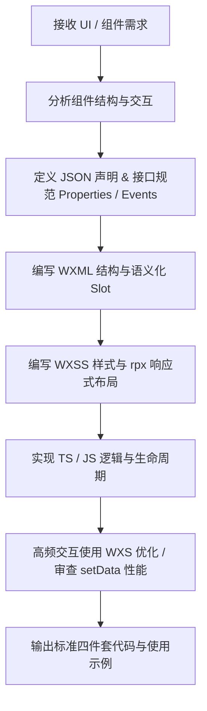

# WeChat Mini Program UI & Component Design Skill (微信小程序 UI/组件技能)

A specialized skill for building high-quality, performant, and accessible WeChat Mini Program UI components and layouts.

---

## 1. 核心职责与设计原则 (Core Principles)

- **小程序规范优先**：严格遵循微信小程序官方自定义组件规范（WXML、WXSS、JS/TS、JSON 四件套）。
- **移动端与 rpx 适配**：以 750rpx 视觉稿为基准设计响应式布局，严控固定 px 带来的机型适配问题。
- **渲染性能红线**：
  - 避免频繁与大体积的 `setData`，局部刷新精确到具体路径字段；
  - 复杂手势与高频动画优先使用 **WXS** 脚本实现视图层响应，绕过逻辑层-视图层通信开销。
- **样式隔离规范**：合理声明 `styleIsolation`（`isolated` / `apply-shared` / `shared`），防止全局样式污染。
- **可复用与语义化**：组件遵循语义化命名、属性类型强约束、完善的事件触发（`triggerEvent`）机制与 Slot 插槽支持。

---

## 2. 知识库索引 (References & Guidelines)

详细技术规范与最佳实践请参考子文档：
- **自定义组件规范**：[references/component-specs.md](./references/component-specs.md)
- **WXSS 样式与布局规范**：[references/styling-standards.md](./references/styling-standards.md)
- **动效与交互优化**：[references/animation-guide.md](./references/animation-guide.md)
- **性能优化清单**：[references/performance-checklist.md](./references/performance-checklist.md)

---

## 3. 工作流 (Workflow)

---

## 4. 预留扩展 (Custom Extensions)

> 本文档结构已就绪，后续会根据你提供的定制提示词与场景规则进行持续补充。
