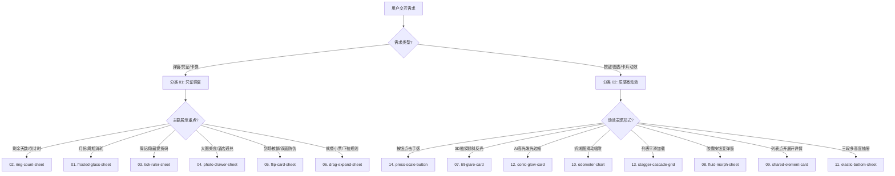

# 组件库全景分类清单与智能推荐指南 (Component Catalog & Recommendation Guide)

本文档是 AI Agent 与开发者的**核心选型决策树**。整合了来自两大工业级视频标准的 **14 种高端交互组件与微动效**，涵盖凭证弹窗与实体交互两大领域。

---

## 🗂️ 核心分类架构 (Taxonomy)

### 分类 01：凭证与卡券流体弹层 (01~06 Popup Panels)
专为会员卡、年卡、消费券、到场核销凭据、预订小票等场景打造的高沉浸度弹窗体系。

| 序号 | 组件标识 | 中文名称 | 核心物理参数 | 最佳适用场景 |
| :--- | :--- | :--- | :--- | :--- |
| **01** | `frosted-glass-sheet` | **玻璃面板浮起** | `BLUR: 26px` `FILL: .42` `STAGGER: 4f` | 12 个月年度计划、配额消耗打卡、保留底层上下文的轻量抽屉。 |
| **02** | `ring-count-sheet` | **圆环计数弹出** | `EASE: (0.2,0.7,0.2,1)` `SCRM: 40%` `RING: 1.2s` | 会员剩余有效天数、借阅期限、到期提醒，第一时间传递数字冲击。 |
| **03** | `tick-ruler-sheet` | **刻度尺扫到今天** | `TICKS: 53` `STAGGER: 1f` `REVEAL: INLINE` | 全年 53 周时间流逝、纸质手账感、需要原地无抖动展开防窥兑换码。 |
| **04** | `photo-drawer-sheet` | **照片抽屉贴合** | `ZOOM: 1.08 -> 1` `OVERLAP: -22px` `BAR: 0 -> 45%` | 美食套餐通兑、度假酒店海报，大图铺满微缩小，下沿抽屉紧密贴合。 |
| **05** | `flip-card-sheet` | **点击翻面凭证** | `PERSP: 1200px` `SNAP: 90°` `BACK: REVERSE` | 营地通兑、入场门票，正面是常规信息，原地 180° 翻转出示核销码。 |
| **06** | `drag-expand-sheet` | **下拉展开面板** | `LINE: DASHED` `SWING: 2°` `SNAP: 40%` | 餐桌凭证、就餐小票，带虚线齿孔与手柄，向下拉动超 40% 展开完整细则。 |

---

### 分类 02：质感微交互与核心组件 (07~14 Tactile Motions)
专为提升 App 和小程序界面“物理实体感”与“手感体验”打造的微互动效。

| 序号 | 组件标识 | 中文名称 | 核心物理参数 | 最佳适用场景 |
| :--- | :--- | :--- | :--- | :--- |
| **07** | `tilt-glare-card` | **3D倾斜光影面板** | `TILT: ±05°` `GLARE: 100%` `SPRING 回正` | 核心装备卡片、滑雪板展示、贵金属卡券，手指触摸跟随 3D 浮动与反光。 |
| **08** | `fluid-morph-sheet` | **流体胶囊形变** | `WIDTH: 176->490` `RADIUS: 30->44` `Fluid Morph` | 顶栏小胶囊按钮点击后如水滴般流畅延展为完整卡片，无生硬弹窗感。 |
| **09** | `shared-element-card` | **共享元素无缝展开** | `SCALE: 1.00->1.09` `SHARED ELEMENT` `Continuous` | 瀑布流卡片点击原地膨胀展开为详情页，无缝衔接无白屏推屏感。 |
| **10** | `odometer-chart` | **磁吸游标与滚动码表** | `SNAP: P01->P12` `TICKER: ODOMETER` `Haptic` | 运动速度折线图、股票走势，手指滑动自动磁吸节点，数字机械码表滚动。 |
| **11** | `elastic-bottom-sheet` | **阻尼弹性抽屉** | `STRETCH: 44px` `LOW / MID / FULL` `Velocity Snap` | 参数配置面板、多段式抽屉，拉到底/顶带橡皮筋阻尼拉伸，松手速度吸附。 |
| **12** | `conic-glow-card` | **动态弥散光晕边框** | `CONIC: 360° 4s` `GLOW: 100%` `2px Border` | AI 核心推荐卡片、高光功能区，2px 慢速旋转流光描边 + 呼吸弥散背光。 |
| **13** | `stagger-cascade-grid` | **物理弹簧交错流** | `STAGGER: 0.10s` `SPRING CASCADE` `0.6s Overshoot` | 照片墙、商品列表加载，各子元素错开 0.1s 带有微弱弹性向上滑入。 |
| **14** | `press-scale-button` | **弹性微缩触觉反馈** | `SCALE: 0.96` `OVERSHOOT: +1.1%` `Inner Shadow` | 关键行动按钮（CTA），按下深凹压缩与内阴影，松手超调回弹 + 原生微震动。 |

---

## 🎯 业务场景决策树 (Decision Tree)

