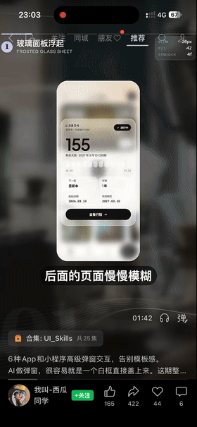
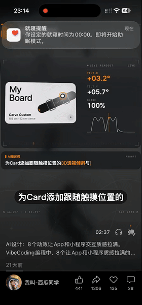
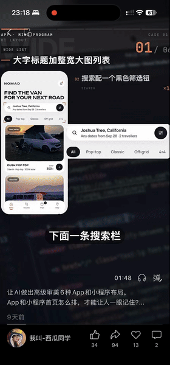
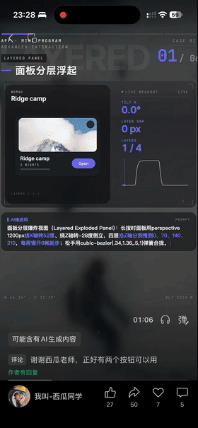
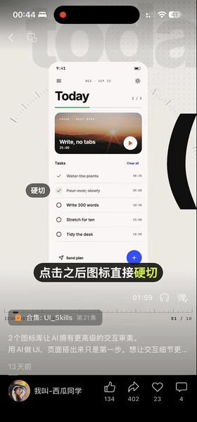
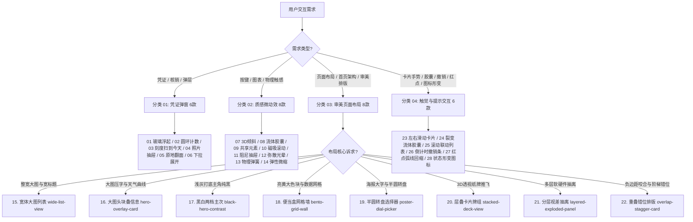

# 组件库全景分类清单与智能推荐指南 (Component Catalog & Recommendation Guide)

本文档是 AI Agent 与开发者的**核心选型决策树**。整合了遵循工业级设计标准的 **28 款高端交互组件、微动效与审美布局**，涵盖：
1. **01 凭证弹窗 (Popup Panels - 6款)**
2. **02 质感微动效 (Tactile Motions - 8款)**
3. **03 审美页面布局 (Aesthetic Layouts - 8款)**
4. **04 触觉高级交互与高级提示动效 (Advanced Interactions & Micro-Toasts - 6款)**

---

## 🗂️ 核心分类架构 (Taxonomy)

### 分类 01：凭证与卡券流体弹层 (01~06 Popup Panels)
专为会员卡、年卡、消费券、到场核销凭据、预订小票等场景打造的高沉浸度弹窗体系。

  

| 序号 | 组件标识 | 中文名称 | 核心物理参数 | 最佳适用场景 |
| :--- | :--- | :--- | :--- | :--- |
| **01** | `frosted-glass-sheet` | **玻璃面板浮起** | `BLUR: 26px` `FILL: .42` `STAGGER: 4f` | 12 个月年度计划、配额消耗打卡、保留底层上下文的轻量抽屉。 |
| **02** | `ring-count-sheet` | **圆环计数弹出** | `EASE: (0.2,0.7,0.2,1)` `SCRM: 40%` `RING: 1.2s` | 会员剩余有效天数、借阅期限、到期提醒，第一时间传递数字冲击。 |
| **03** | `tick-ruler-sheet` | **刻度尺扫到今天** | `TICKS: 53` `STAGGER: 1f` `REVEAL: INLINE` | 全年 53 周时间流逝、纸质手账感、需要原地无抖动展开防窥兑换码。 |
| **04** | `photo-drawer-sheet` | **照片抽屉贴合** | `ZOOM: 1.08 -> 1` `OVERLAP: -22px` `BAR: 0 -> 45%` | 美食套餐通兑、度假酒店海报，大图铺满微缩小，下沿抽屉紧密贴合。 |
| **05** | `flip-card-sheet` | **点击翻面凭证** | `PERSP: 1200px` `SNAP: 90°` `BACK: REVERSE` | 营地通兑、入场门票，正面是常规信息，原地 180° 翻转出示核销码。 |
| **06** | `drag-expand-sheet` | **下拉展开面板** | `LINE: DASHED` `SWING: 2°` `SNAP: 40%` | 餐桌凭证、就餐小票，带虚线齿孔与手柄，向下拉动超 40% 展开完整细则。 |

---

### 分类 02：质感微交互与核心组件 (07~14 Tactile Motions)
专为提升 App 和小程序界面“物理实体感”与“手感体验”打造的微互动效。

  

| 序号 | 组件标识 | 中文名称 | 核心物理参数 | 最佳适用场景 |
| :--- | :--- | :--- | :--- | :--- |
| **07** | `tilt-glare-card` | **3D倾斜光影面板** | `TILT: ±05°` `GLARE: 100%` `SPRING 回正` | 核心装备卡片、滑雪板展示、贵金属卡券，手指触摸跟随 3D 浮动与反光。 |
| **08** | `fluid-morph-sheet` | **流体胶囊形变** | `WIDTH: 176->490` `RADIUS: 30->44` `Fluid Morph` | 顶栏小胶囊按钮点击后如水滴般流畅延展为完整卡片，无生硬弹窗感。 |
| **09** | `shared-element-card` | **共享元素无缝展开** | `SCALE: 1.00->1.09` `SHARED ELEMENT` `Continuous` | 瀑布流卡片点击原地膨胀展开为详情页，无缝衔接无白屏推屏感。 |
| **10** | `odometer-chart` | **磁吸游标与滚动码表** | `SNAP: P01->P12` `TICKER: ODOMETER` `Haptic` | 运动速度折线图、股票走势，手指滑动自动磁吸节点，数字机械码表滚动。 |
| **11** | `elastic-bottom-sheet` | **阻尼弹性抽屉** | `STRETCH: 44px` `LOW / MID / FULL` `Velocity Snap` | 参数配置面板、多段式抽屉，拉到底/顶带橡皮筋阻尼拉伸，松手速度吸附。 |
| **12** | `conic-glow-card` | **动态弥散光晕边框** | `CONIC: 360° 4s` `GLOW: 100%` `2px Border` | AI 核心推荐卡片、高光功能区，2px 慢速旋转流光描边 + 呼吸弥散背光。 |
| **13** | `stagger-cascade-grid` | **物理弹簧交错流** | `STAGGER: 0.10s` `SPRING CASCADE` `0.6s Overshoot` | 照片墙、商品列表加载，各子元素错开 0.1s 带有微弱弹性向上滑入。支持点击重播与按压反馈。 |
| **14** | `press-scale-button` | **弹性微缩触觉反馈** | `SCALE: 0.96` `OVERSHOOT: +1.1%` `Inner Shadow` | 关键行动按钮（CTA），按下深凹压缩与内阴影，松手超调回弹 + 原生微震动。 |

---

### 分类 03：高级审美页面布局 (15~22 Aesthetic Layouts - 8款)
涵盖经典高级审美布局与高级排版几何原理，彻底打破模板化流水线排版：

  

| 序号 | 组件标识 | 中文名称 | 核心设计参数与 HUD 标准 | 最佳适用场景 |
| :--- | :--- | :--- | :--- | :--- |
| **15** | `wide-list-view` | **宽体标题整宽大图列表 (Wide List)** | `TYPE: WIDE CAPS` `IMG: 16:10 FULL` `ROW: META + CIRCLE` | 房车露营、度假胜地、建筑摄影等重画面感的高端电商列表。 |
| **16** | `hero-overlay-card` | **大图头块叠信息与温度曲线 (Hero Overlay)** | `HERO: 1/3 SCREEN` `ACTIVE: #151213` `CURVE: SMOOTH WAVE` | 城市漫游出行、旅行指南、天气日程一体化仪表盘。 |
| **17** | `black-hero-contrast` | **黑白两档主次架构 (Black Hero)** | `BASE: #F4F3F4` `HERO: #0B0708` `HIERARCHY: 2-TIER` | 读书书房、极简知识库、音乐播放界面，主弱宾强一眼记住。 |
| **18** | `bento-grid-wall` | **便当盒网格墙 (Bento Grid)** | `HERO: BIG YELLOW` `RING: 73%` `GRID: 4-COL` | 首页仪表盘、习惯养成打卡墙、多维度数据健康汇聚。 |
| **19** | `poster-dial-picker` | **海报大字半圆转盘选择器 (Poster Dial)** | `FONT: POSTER BOLD` `DIAL: SEMICIRCLE` `POINTER: TOP SNAP` | 专注番茄钟、模式切换、仪式感强的日程清单选择器。 |
| **20** | `stacked-deck-view` | **层叠卡片牌组 (Stacked Deck)** | `PERSP: 1000px` `SCALE: 0.88/0.94/1` `SWIPE: -80px` | 精选推荐、每日卡片、特权探索，卡片如纸牌向上推走滑出。 |
| **21** | `layered-exploded-panel` | **分层视差抽离面板 (Layered Exploded)** | `EXPLODE: 70rpx` `TILT: -16deg / 22deg` `MULTI-LAYER` | 硬件拆解、黑科技分层、复杂架构图解、VIP 权益分层透视展示。 |
| **22** | `overlap-stagger-card` | **重叠咬合与阶梯错位排版 (Overlap & Stagger)** | `OVERLAP: 42px` `STAGGER: 40rpx` `Z-INDEX: 3-TIER` | 负外边距卡片咬合压住底图标签与左右不对称阶梯，制造设计秩序感。 |

---

### 分类 04：触觉高级手势交互与高级提示动效 (23~28 Advanced Interactions & Micro-Toasts - 6款)
基于微信原生 WXS 运行于渲染层，实现 60fps 零延迟跟手交互，以及“不抢戏但在对的时候出现、用对的方式消失”的高级提示机制：

  
  &nbsp;&nbsp;&nbsp;&nbsp;
  

| 序号 | 组件标识 | 中文名称 | 核心物理参数 | 最佳适用场景 |
| :--- | :--- | :--- | :--- | :--- |
| **23** | `swipe-card-stack` | **左右滑动堆叠 (Swipe Stack)** | `SWIPE: ±120px` `ROT: (dx/160)*14°` `WXS TOUCH` | 探索挑选、Tinder 模式卡片快速决策、活动卡片连续浏览。 |
| **24** | `split-button-morph` | **裂变流体胶囊 (Split Button)** | `EXPAND: 420rpx` `STAGGER: 0.12s` `Haptic Medium` | 多功能快捷操作条、分享与收藏二合一、状态切换悬浮胶囊。 |
| **25** | `scroll-spy-category` | **滚动联动分类 (Scroll Spy)** | `STICKY: 0` `ACTIVE-TRACK` `Smooth Scroll` | 外卖点餐、电商分类瀑布流、长文档大纲导航。 |
| **26** | `undo-timer-bar` | **倒计时进度撤销条 (Undo Timer Bar)** | `COUNTDOWN: 4.0s` `PROGRESS: 100->0` `RESTORE INLINE` | 误删撤回、关键危险操作缓冲提示，倒计时看得到、走完才自然消失。 |
| **27** | `dot-rebound-scatter` | **红点原位弧线回缩与三级联动消散 (Dot Rebound)** | `ARC: (-20rpx,-14rpx)` `SCALE: 1->0` `STAGGER: 4f (70ms)` | 消息已读消除，红点缩回它来的地方而非原地淡出，单行/分组/顶部总数三层联动。 |
| **28** | `state-morph-icon` | **状态形变图标与动作即反馈 (State Morph Icon)** | `MORPH: PATH/CSS` `ACTION AS FEEDBACK` `HAPTIC SYNC` | 汉堡与叉号平滑形变、播放与暂停切换、点击发送自身变成飞行动作与完成状态。 |

---

## 🎯 业务场景决策树 (Decision Tree)

